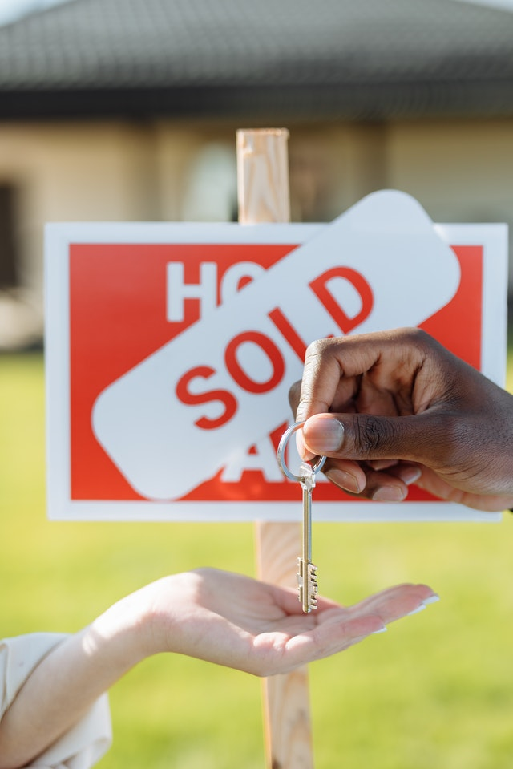

 
# House Sale Price Prediction
Machine Learning brings out the power of data in a new way 🎇.

The goal of this project is to apply Supervised Learning skills in order to develop a House Sale Price 💰 prediction model for individuals working in the housing market 🏡 as well as for potential buyers.

## The project is divided into 2 parts (one folder per part):

- In EDA folder there is a dataset stored in houses_dataset.csv. The data is uploaded into Data Wrangling.ipynb file. There we perform Data Wrangling and a part of EDA. Most of Summary Statistics is in SLR folder. After data has been prepared for next step, we export it into houses_dataset_edited.csv
- 
- In SLR folder, we begin by uploading data from houses_dataset2.csv into Statistical Analysis and SLR.ipynb. Houses_dataset2.csv is similar to houses_dataset_edited.csv only with minor corrections. In Statistical Analysis and SLR.ipynb file, we finish EDA and Summary Statistics, divide data into train and test subsets, and build a Univariate Regression Model. The result is R-squared equal to 0.629 and an MSE of 4.13 × 10-5 for train data and 4.2 × 10-5 for test data.

## Python 🐍 Libraries and packages used throughout the project:

We use Pandas and NumPy with summary statistics and graphical representation 📊 (Matplotlib and Seaborn) to uncover the relationship between features and a target.

We built our Regression Model 📈 utilizing scikit-learn and statsmodels.api.

Authors

- [@SvetlanaRedkina](https://github.com/SvetlanaRedkina)

Honest feedback

- If you have any feedback, please reach out to me at sveta.hq@gmail.com

I am glad you have visited my project 🌸 
